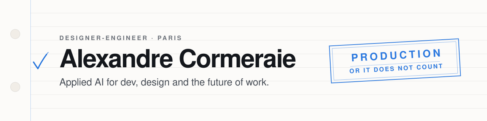

<picture>
  <source media="(prefers-color-scheme: dark)" srcset="assets/header-dark.svg" />
  
</picture>

I work on AI deployment at **SNCF Voyageurs**, where the question is not whether a coding
agent is impressive but whether thousands of people can be trusted with one. That is a
product problem, a security problem and a design problem at the same time, and it is the
one I spend my days on.

Everything below started as something I needed and could not buy. I ship the tools rather
than write about them, and I ship them finished: error handling, licences, a real README,
a page you can send to someone.

**Paris · open to conversations about applied AI, developer tooling and design engineering.**

---

## Selected work

| | What it solves | Built with |
| --- | --- | --- |
| **[Corporate Launcher](https://github.com/Connected-Mate/corporate-launcher)** | Turns any public AI coding CLI — Claude Code, Codex, Gemini, Cursor, Aider — into a company's own internal, audit-grade launcher. One structured interview produces 15 cyber controls, 30+ audit rules, a compliance `.docx` and universal cost tracking. The answer to "we cannot let a public CLI near our codebase". | Python |
| **[Annotate Kit](https://github.com/Connected-Mate/annotate-kit)** | Coding agents are blind to the screen. Point at an element — on a [web page](https://connected-mate.github.io/annotate-kit/try.html) or in a [running iOS app](https://github.com/Connected-Mate/annotate-kit-ios) — write what should change, and the agent receives the element's identity, its surroundings and a marked screenshot instead of "the blue button, no, the other one". | TypeScript · Swift |
| **[SpecDrive](https://github.com/Connected-Mate/specdrive)** | Spec-driven development, enforced. An MCP server and Mac app that walks coding agents through specs, scenarios, proof-gated tasks and independent review — because prompts get forgotten and tools cannot. | TypeScript · Electron · MCP |
| **[gptimage](https://github.com/Connected-Mate/gptimage)** | Image generation inside Claude Code billed to a ChatGPT subscription instead of an API key. MCP server, skill and CLI in one. | JavaScript · MCP |
| **[imessage-connector](https://github.com/Connected-Mate/imessage-connector)** | Gives a coding agent read, search, send and react on macOS iMessage — behind a policy engine whose layers can only ever narrow, never widen. | TypeScript · MCP |
| **[fable-mindset](https://github.com/Connected-Mate/fable-mindset)** | A model's working discipline — decomposition, verification, orchestration, autonomous loops — extracted into portable Claude Code skills anyone can run for free. | Shell · Claude Code skills |
| **[MacPulse](https://github.com/Connected-Mate/MacPulse)** | A macOS menu-bar monitor with a local-AI readiness gauge: whether this Mac can run the Ollama model you are about to ask it for, right now. One Swift file, zero dependencies. | Swift |

More in the repository list — [TokenWatt](https://github.com/Connected-Mate/TokenWatt) measures
Claude Code spend in toasts and washing-machine cycles, and
[Banana Slides](https://github.com/Connected-Mate/banana-slides) generates decks from a
ChatGPT login.

---

## How I work

- **The user's experience decides the argument.** Not the framework, not what is convenient
  to implement. If a choice is worse for the person in front of the screen it loses, and it
  usually loses in the first five minutes rather than in review.
- **Production or it does not count.** Error paths, edge cases, licences, security, the
  README someone else has to read. A demo that cannot ship is a slide, not a product.
- **Design is not the last 5%.** Most of these tools exist because the good version of the
  idea was unusable, and the difference was interface, not capability.
- **Constraints from the real job.** Working inside a large, regulated company is what
  taught me that the interesting problem is rarely the model — it is authorisation, cost,
  auditability, and whether a non-technical colleague gets it on the first try.

## Working with

`Swift` · `SwiftUI` · `TypeScript` · `React` · `Next.js` · `Node` · `Python` · `Electron` ·
`MCP` · `Claude Code` · `Codex` · `AppleScript` · `GitHub Actions`

## Elsewhere

- **[connectedmate.com](https://connectedmate.com)** — AI talks, podcasts and Apple apps
- **[cormeraie.fr](https://cormeraie.fr)** — a bilingual editorial notebook
- **[@AlexCormeraie](https://twitter.com/AlexCormeraie)** on X
